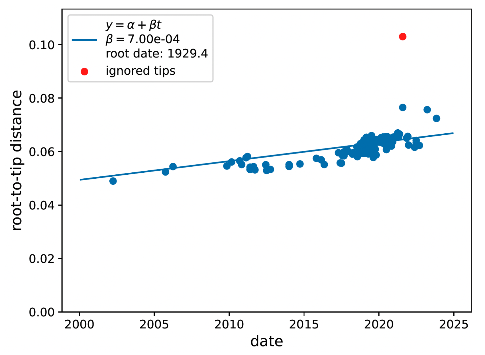
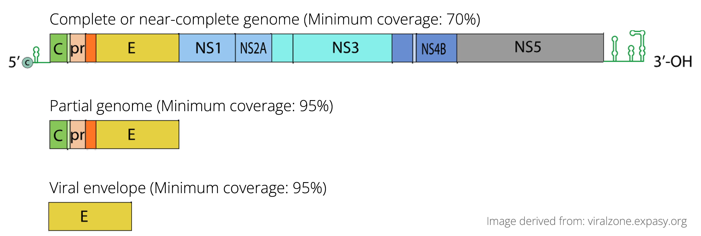

# dengueQA - a pipeline for quality assurance of consensus dengue virus genomes

This pipeline processes dengue virus sequencing data to perform quality assurance of genomic data. To do so it runs steps of genotyping, sequence alignment, genome coverage calculation, and molecular clock analysis.

## Installation

1. Clone the repository:
    ```bash
    git clone https://github.com/InstitutoTodosPelaSaude/dengueQA.git
    cd dengueQA
    ```

2. Install dependencies:
    ```bash
    conda env create -f config/dengueQA.yaml
    conda activate dengueQA
    ```

## Usage

1. Edit the Snakefile to specify your input files and parameters.
2. Run the pipeline:
    ```bash
    snakemake all --cores all
    ```

## Workflow

The pipeline consists of the following steps:

1. **BLAST searches**: Perform BLAST searches for serotyping, genotyping, and lineage assignment according to reference files provided by ['dengue-lineages'](https://dengue-lineages.org/design.html) nomenclature system.
2. **Dataset splitting**: Split datasets based on dengue serotypes.
3. **Sequence alignment**: Align newly sequenced genomes with reference genomes using `augur align`.
4. **Coverage calculation**: Calculate coverage per coding region (CDS) and whole genomes.
5. **Contextual genome selection**: Select contextual genomes for root-to-tip analysis.
6. **Dataset compilation**: Join new sequences with contextual genomes.
7. **Metadata processing**: Add missing columns and process metadata.
8. **Phylogenetic analysis**: Align genomes (`augur align`), mask 5' and 3' untranslated regions (`augur mask`), build phylogenetic trees (`iqtree`), and perform root-to-tip analysis (`treetime`).
9. **Quality assurance**: Generate quality assurance report containing information about genomic coverage (flagging low coverage coding regions (CDS) and whole genomes) and sequence quality (flagging molecular clock outliers).


## Sequence quality criteria

Using this pipeline, the quality assurance report reveals important statistics to evaluate genomes under the following criteria:

1. Evolutionary rates with strong deviations from the molecular clock
2. Minimum coverage of both whole genome and specific coding regions.

The molecular clock quality analysis (1) aims to identify genomes whose evolutionary rates deviate more than 10 interquartile ranges from the trend line produced by high-quality genomes. This cutoff is rather permissive, and was set on purpose to avoid exclusion of genomes that may have naturally higher evolutionary rates.

<div style="text-align: center;">
    
</div>

> In this example, the correlation between genetic distance (y axis) and time (x axis) of the root-to-tip molecular clock analysis identified one sequence with evolutionary rate the deviates from the expected, being flagged as a potentially low quality sequence.


The genome coverage analysis (2) aims to identify genomes with less than 70% coverage, the minimum cutoff used for submitting the sequence as 'complete genome' or 'near-complete genome' to public databases. When sequences have less than 70% coverage, specific genomic fragments are evaluated for possible submission as partial sequences, thery are: the C-prM-E region (~2300 bp) and the viral envelope region (E, ~1500 bp) (see image below). In this order, if any of the regions have at least 95% coverage, it could be submitted to databases as genomic fragments, still relevant for specific analyses.

<div style="text-align: center;">
    
</div>

> Examples of sequences of interest for submission to public genomic databases, according to their levels of completeness.

## Author

* **Anderson Brito, Instituto Todos pela Saúde (ITpS)** - [Website](https://www.itps.org.br/membros) - anderson.brito@itps.org.br

## License

This project is licensed under the MIT License.
